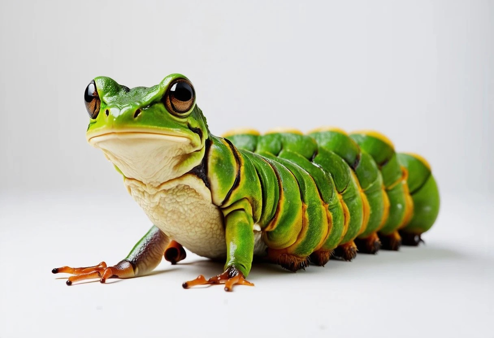

## Animal Breeder
- MERN stack web app
- A functional prototype for a fictional animal breeding website, leveraging ChatGPT and some of the latest Image Diffusion models.

  ---
  
### Example: frog crossed with caterpillar:
  
